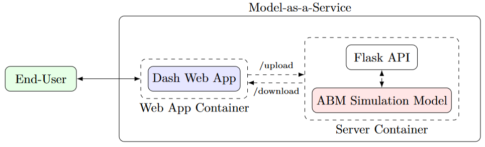
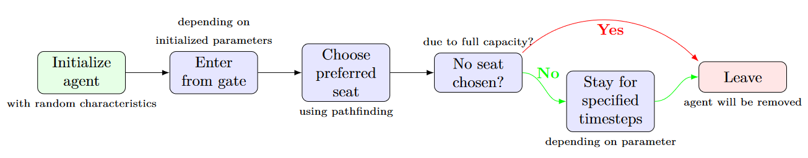
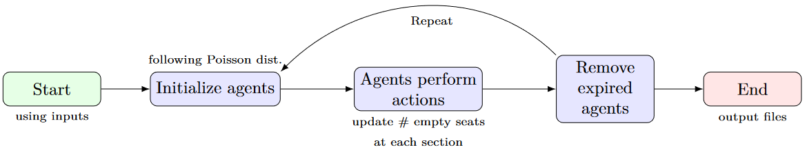
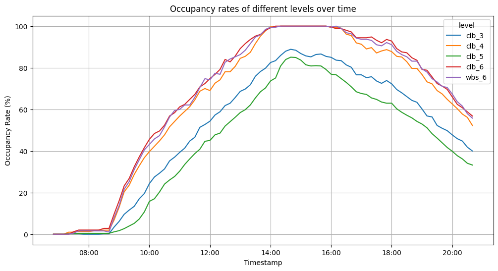
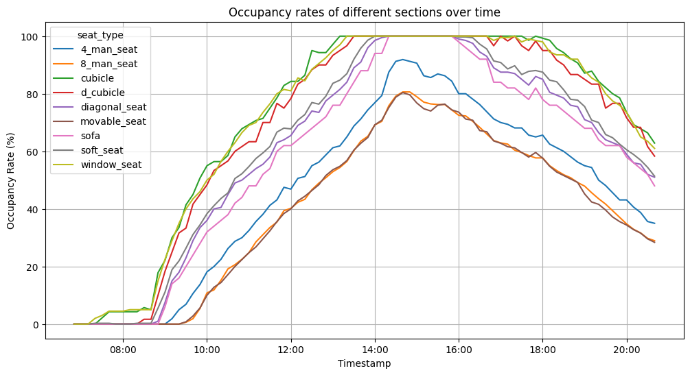
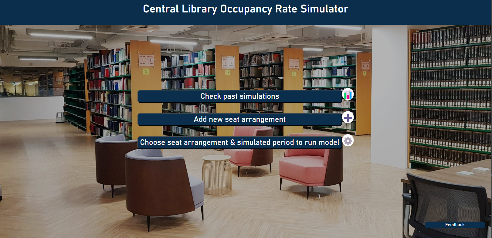
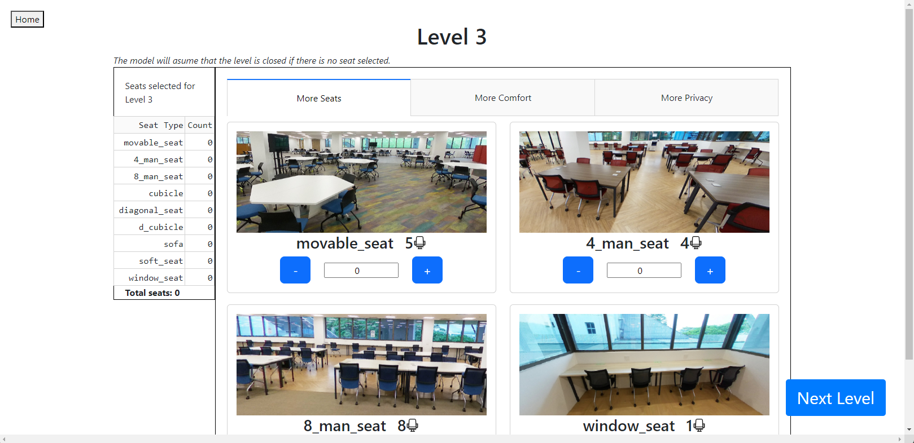
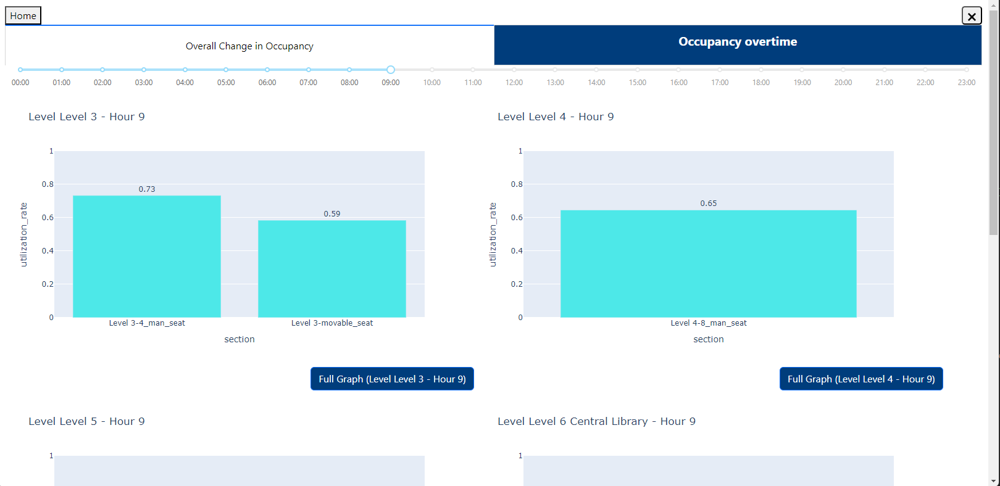
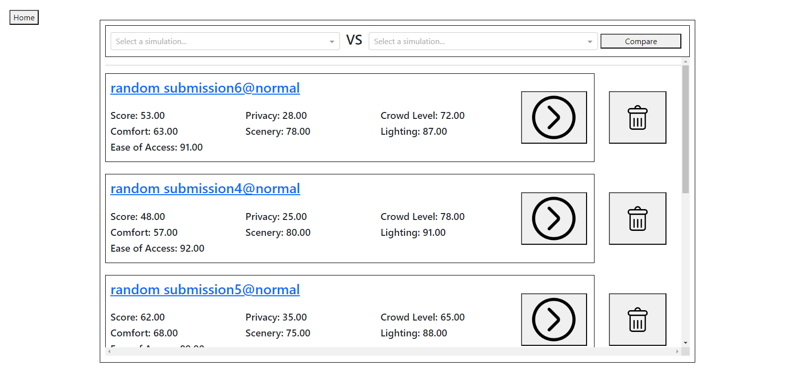

# dsa3101-2310-01-library

# Library Seating Occupancy Simulation

## Introduction
An application to help library staff maximise seat occupancy and gain greater insights regarding user distribution across space and time, through the simulation of student behaviours.

## End-product architecture

### Backend architecture


## Agent-based simulation model
Our group implemented an agent-based simulation model, where the library user is represented as an agent with random characteristics, and library sections are represented as nodes in a connected graph.
<br><br/>

*<p style="text-align: center;">Agent behaviour lifecycle</p>*

<br><br/>

*<p style="text-align: center;">Simulation flow</p>*

### Model performance


Overall, the simulation model captures the general trend of occupancy rates, with peak period being 1-6pm. As expected, levels 3 and 5 are not as popular compared to other levels, which might be due to sharing of seats with strangers, as well as the lack of connection to the entrance and exit gates.

## How to run
1. Clone the repo
```
git clone git@github.com:dsa3101-2310-01-library/dsa3101-2310-01-library.git
```
2. Ensure docker has been installed and running
```
docker info
```
3. Run docker compose
```
docker-compose up --build -d
```
4. Open a chrome or edge browser and go to `http://localhost:9002`

## Snapshot of the application
### Home page

### Input seat arrangement page

### Simulation page

### View past Simulation page


## How to contribute to this repo
1. Fork the team repo (only need to do this once)
2. Clone the forked repo (yourusername/dsa3101-2310-library) onto your computer (only need to do this once)
3. Navigate to repo and type in terminal `git remote add upstream git@github.com:dsa3101-2310-01-library/dsa3101-2310-01-library.git` (only need to do this once)
4. Need to do this every time: `git pull upstream`
5. For backend, create `data` folder on your computer, then add the entry-exit data from the library to the `data/` folder only on your computer (`.gitignore` will ignore this folder automatically)
6. Make the changes
7. Commit to your own forked repo
8. Create a pull request with the changes to the team repo
9. 1 or 2 of us can review the PR
10. Merge (to be done by reviewer)
